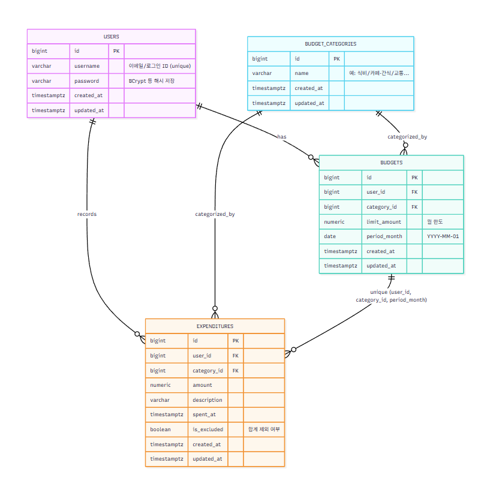

# 예산 관리 어플리케이션

## 프로젝트 기간
2025.08. ~ 2025

 

## 목차
- [개요](#개요)
- [Skils](#skils)
- [ERD](#erd)
- [프로젝트 설계 및 일정관리](#프로젝트-설계-및-일정관리)
  - [API Reference](#api-reference)
  - [API 구현과정 및 고려사항](#api-구현과정-및-고려사항)
- [Test](#test)
  - [주요 시나리오](#주요-시나리오)

 

## 개요
본 서비스는 사용자들이 개인 재무를 관리하고 지출을 추적하는 데 도움을 주는 애플리케이션입니다. 이 앱은 사용자들이 예산을 설정하고 지출을 모니터링하며 재무 목표를 달성하는 데 도움이 됩니다.

 

## Skils
언어 및 프레임워크: 

 
DB: 

 

## ERD

 

## 프로젝트 설계 및 일정관리

### API Reference

Budgets - click

- Budget 카테고리 목록 조회 
    - [GET] /api/budget-categories

- Budget 설정 
    - [POST] /api/budgets

- Budget 수정 
    - [PATCH] /api/budgets/{budgetId}

- Budget 설계 추천 
    - [GET] /api/budgets/recommend

 

Expenditures - click

- Expenditure 생성 
    - [POST] /api/expenditures

- Expenditure 수정 
    - [PATCH] /api/expenditures/{expenditureId}

- Expenditure 목록 조회 
    - [GET] /api/expenditures

- Expenditure 상세 조회 
    - [GET] /api/expenditures/{expenditureId}

- Expenditure 삭제 
    - [DELETE] /api/expenditures/{expenditureId}

- Expenditure 합계 제외 
    - [PATCH] /api/expenditures/except/{expenditureId}

- Expenditure 추천 
    - [GET] /api/expenditure/recommend

- Expenditure 안내 
    - [GET] /api/expenditure/guide

Users - click

- User 회원가입 
    - [POST] /api/users

- User 로그인 
    - [POST] /api/users/login

 

### API 구현과정 및 고려사항

 

Budgets - click

- 중복 예산 방지: (user_id, category_id, period_month) 유니크
- 월 경계 처리: period_month는 매월 1일 고정
- 추천: 사용자 히스토리 기반 평균/중위값·카테고리 비중·잔액 대비 가이드
- 동시성: 동일 월/카테고리 갱신 시 비관/낙관락 중 하나 택일

 

 

Expenditures - click

- is_excluded=true 시 합계·분석에서 제외
- 조회 필터: 기간(월/일), 카테고리, 금액 범위, 키워드
- 인덱스: (user_id, spent_at), (user_id, category_id, spent_at)
- 삭제 정책: 기본 soft delete 불사용(요구 시 추가)

 

 

Users - click

- 비밀번호 해시(BCrypt), 로그인 시 JWT 발급
- 이메일 중복 방지, 입력 검증(형식/길이/복잡도)

 

## Test

- 단위 테스트: Service/Repository 레벨 (@DataJpaTest, Mockito)
- 통합 테스트: WebMvcTest/RestAssured로 API 계약 검증

### 주요 시나리오

- 예산 생성/수정/중복 방지
- 지출 생성/수정/목록/합계 제외
- 추천/가이드 응답의 기본 통계 검증
- 회원가입/로그인/JWT 인증 흐름
- 품질 목표: 라인 커버리지 70%+, 핵심 도메인(서비스) 90%+