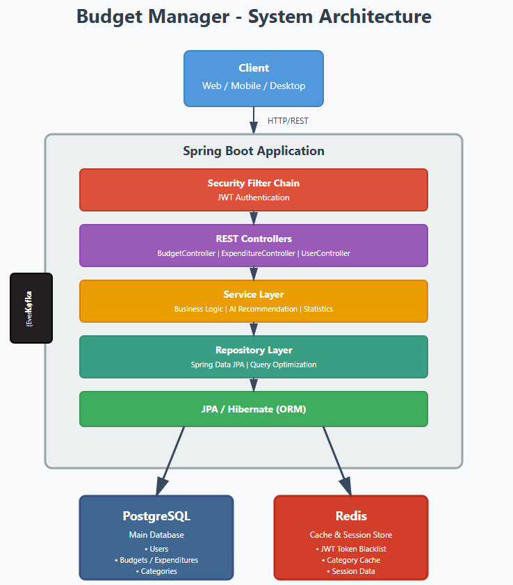
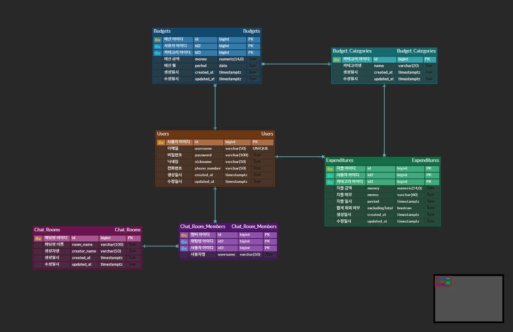
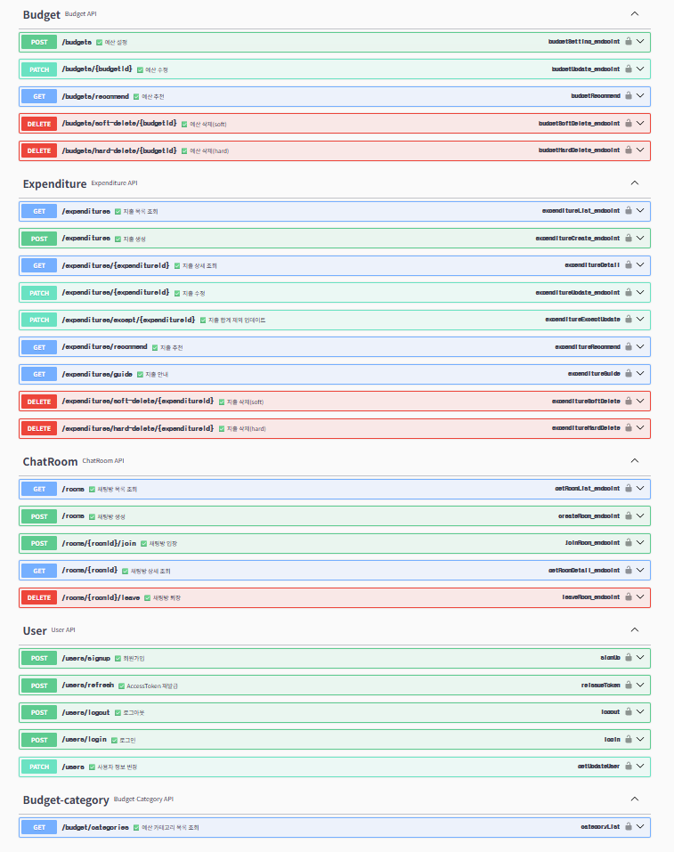

# 예산 관리 어플리케이션

## 📋목차
- [🎯 프로젝트 개요](#프로젝트-개요)
- [🛠 기술 스택](#-기술-스택)
- [🏗 시스템 아키텍처](#-시스템-아키텍처)
- [📡 API 명세](#-api-명세)
- [✨ 주요 기능 개발](#-주요-기능-개발)
- [🧪 테스트 전략](#-테스트-전략)
- [📚 프로젝트 관리](#-프로젝트-관리)

<br/>

---
## 🎯프로젝트 개요

- 개발기간: 2025.09 ~ 2025.12
- 사용자가 월별 예산을 설정하고 지출을 기록하여 재무 목표를 달성할 수 있도록 돕는 개인 재무 관리 애플리케이션입니다.

#### 핵심 가치

- `📊 통계 기반 추천`: 전체 사용자 데이터를 분석하여 최적의 예산 배분 제안
- `🎯 실시간 피드백`: 오늘의 권장 지출액과 소비 패턴 분석 가이드 제공
- `🔒 보안 중심 설계`: Spring Security와 JWT, Redis를 활용한 견고한 인증 체계 
- `⚡ 확장성 고려`: Kafka와 WebSocket을 활용한 실시간 채팅 및 알림 시스템

<br/>

---
## 🛠 기술 스택

언어 및 프레임워크: 


<br/>
DB: 

<br/>
ETC: 

<br/>

---
### 🏗 시스템 아키텍처


<br/>

### ERD


<br/>

## 📡 API 명세


<br/>

## ✨ 주요 기능 개발

<details> 
 
<summary>예산 관리 및 추천 엔진 (Budgets) - click</summary>

#### 예산 관리 (Budgets)
- 설계 의도: 사용자가 막연하게 예산을 설정하는 대신, 타 사용자의 데이터를 기반으로 합리적인 가이드 제공
- 구현 핵심:
  - 통계 기반 배분 알고리즘: 전체 사용자의 카테고리별 예산 비율을 산출하여, 사용자의 총 예산액에 맞춰 자동 배분하는 로직 구현
  - 데이터 무결성: 카테고리별 예산 설정 및 Soft/Hard Delete 지원을 통해 분석 데이터의 정확성 유지

</details> 

<details> 

<summary>지출 관리 및 지능형 가이드 (Expenditures) - click</summary>

#### 지출 관리 (Expenditures)
- 설계 의도: 사용자가 스스로 소비를 통제할 수 있도록 자동화된 피드백 루프 구축
- 구현 핵심:
  - 오늘의 지출 추천 (매일 08:00): 남은 예산을 남은 일수로 계산하여 오늘 사용 가능한 적정 금액을 매일 아침 전송
  - 오늘의 지출 안내 (매일 22:00): 오늘 사용한 금액과 권장 금액을 비교하여 소비 패턴에 대한 요약 보고서 전송
  - 동적 쿼리 최적화: 기간, 카테고리, 금액 범위 등 다각도 조회를 위한 고성능 필터링 기능

</details> 

<details> 

<summary>실시간 채팅 인프라 (Chat & Messaging) - click</summary>

#### 채팅 (Chat)
- 설계 의도: 대규모 메시지 처리가 가능한 채팅 시스템 구축
- 구현 핵심:
  - Kafka 기반 브로드캐스팅: WebSocket으로 수신된 메시지를 Kafka Topic으로 발행하여 다중 서버 환경에서도 메시지 유실 없는 실시간 전송 보장
  - 비동기 처리: 메시지 저장과 발송을 비동기적으로 분리하여 대량의 트래픽에도 낮은 응답 지연 시간 유지

</details>

<br/>

---
##  🧪 테스트 전략
- Unit Test: Mockito를 사용하여 Service 레이어의 비즈니스 로직을 독립적으로 검증
- Integration Test: @SpringBootTest를 활용하여 API 엔드포인트와 DB/Redis/Kafka 연동 테스트 수행
- Coverage: 핵심 도메인 로직(Service)에 대해 80% 이상의 테스트 커버리지를 목표로 설계

---
## ⚙️ 환경 설정
### 환경 변수 (.env)
```makefile
# 공통 Postgresql 설정
POSTGRES_HOST={POSTGRES_HOST}
POSTGRES_PORT={POSTGRES_PORT}
POSTGRES_DB=${POSTGRES_DB}
POSTGRES_USER=${POSTGRES_USER}
POSTGRES_PASSWORD=${POSTGRES_PASSWORD}
POSTGRESQL_URL=jdbc:postgresql://{SERVER_PORT}:{POSTGRES_PORT}/{POSTGRES_DB}

# 공통 redis 설정
REDIS_HOST=${REDIS_HOST}
REDIS_PORT={REDIS_PORT}
REDIS_USER=${REDIS_USER}
REDIS_PASSWORD=${REDIS_PASSWORD}

# 공통 kafka 설정
KAFKA_SERVER=${KAFKA_SERVER}
KAFKA_GROUP_ID=${KAFKA_GROUP_ID}

# mail 정보
MAIL_USERNAME=${MAIL_USERNAME}
MAIL_PASSWORD=${MAIL_PASSWORD}

# JWT 설정
JWT_SECRET=${JWT_SECRET}
``` 

### 실행 방법
```bash
# 서비스 빌드 및 실행
make service-build
make service-run

# .env 파일 수정 (필요시)
vim .env

# API 문서 확인
로컬: http://localhost:9091/swagger-ui/index.html
배포: https://kyongseo.github.io/Budgets/

# Swagger 문서 업데이트 (API 변경 시)
# 방법 1: 수동 업데이트
# 1) 애플리케이션 실행 (다른 터미널)
make service-boot-run

# 2) OpenAPI JSON 생성 및 배포
make swagger-deploy

# 방법 2: 자동 업데이트 (앱 시작 + JSON 생성)
make swagger-update

```

---
## 📚 프로젝트 관리
- API 문서: [Swagger API](https://kyongseo.github.io/Budgets/#/)
- 일정 관리: [일정관리](https://www.notion.so/b7b4131ed6874ff6825c62499d183230)